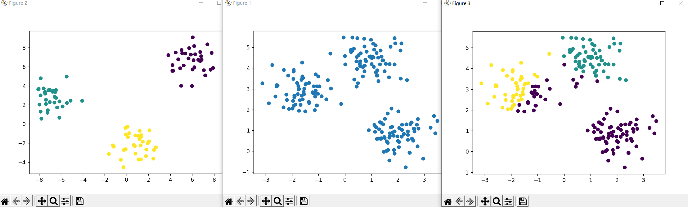
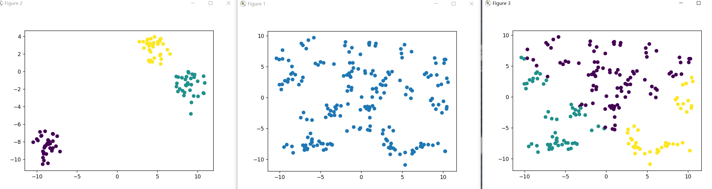

# Kmeans

## 概述

聚类属于非监督学习，K均值聚类是最基础常用的聚类算法。它的基本思想是，通过迭代寻找K个簇（Cluster）的一种划分方案，使得聚类结果对应的损失函数最小。其中，损失函数可以定义为各个样本距离所属簇中心点的误差平方和：

$J(c,u) = \sum_{i=1}^M||x_i-\mu_{ci}||^2$

其中$x_i$为第i个样本，$c_i$为$x_i$所属的簇，$\mu_{ci}$代表簇对应的中心点，$M$为样本总数

## 具体步骤

1. 数据预处理，去掉异常数据
2. 随机选取k个中心，记为$\mu_1,\mu_2....\mu_k$
3. 定义损失函数：$J(c,u) = \sum_{i=1}^M||x_i-\mu_{ci}||^2$
4. 迭代使J收敛
   1. 对于每个样本，将其分配到距离最近的中心
   2. 对于每个中心k，重新计算该类的中心

**KMeans最核心的部分就是先固定中心点，调整每个样本所属的类别来减少 J ；再固定每个样本的类别，调整中心点继续减小J 。两个过程交替循环， J 单调递减直到最（极）小值，中心点和样本划分的类别同时收敛。**

## 代码实现

### sklearn工具箱


```python
from sklearn.cluster import KMeans
from sklearn.datasets import make_blobs
import matplotlib.pyplot as plt
#参数：
# n_samples=100  样本数量
# n_features=2   特征数量
# centers=3      中心点

#返回值：
# X_train:  训练集
# y_train： 特征值

X_train,y_train = make_blobs(n_samples=100, n_features=2, centers=3)

# 再生成一组作为测试集使用，设置43个中心，主打一个杂乱无章
X, y = make_blobs(n_samples=200, centers=43, cluster_std=0.60, random_state=0)

# 参数
# n_clusters  将预测结果分为几簇

kmeans = KMeans(n_clusters=3)  # 获取模型
kmeans.fit(X_train)  # 要分类的数据给他，对模型进行训练

y_ = kmeans.predict(X)
print(y_) # 预测结果
# 画出还未进行划分的预测集
plt.scatter(X[:,0],X[:,1])
plt.figure()
# 训练集的点加答案
plt.scatter(X_train[:,0],X_train[:,1],c=y_train) # 原结果
plt.figure()
# 预测结果的的点和对应所属的聚合
plt.scatter(X[:,0],X[:,1],c=y_)  # 预测结果

plt.show()
```


以下结果至左向右分别为训练集加特征值、测试集、测试集和对应的特征值(训练集生成三簇，测试集也有意生成三簇)



以下结果为测试集生辰43簇，模拟无序的状态



### 手动实现

```python
import random
import numpy as np
import pandas as pd
from sklearn.datasets import make_blobs
import matplotlib.pyplot as plt

X_train, y_train = make_blobs(n_samples=100, n_features=2, centers=3)


# 计算欧几里得距离
def calcDis(dataSet, centroids, k):
    clalist = []
    for data in dataSet:
        diff = np.tile(data, (k,1)) - centroids  # 相减   (np.tile(a,(2,1))就是把a先沿x轴复制1倍，即没有复制，仍然是 [0,1,2]。 再把结果沿y方向复制2倍得到array([[0,1,2],[0,1,2]]))
        squaredDiff = diff ** 2  # 平方
        squaredDist = np.sum(squaredDiff, axis=1)  # 和  (axis=1表示行)
        distance = squaredDist ** 0.5  # 开根号
        clalist.append(distance)
    clalist = np.array(clalist)  # 返回一个每个点到质点的距离len(dateSet)*k的数组
    return clalist


# 计算质心
def classify(dataSet, centroids, k):
    # 计算样本到质心的距离
    clalist = calcDis(dataSet, centroids, k)
    # 分组并计算新的质心
    minDistIndices = np.argmin(clalist, axis=1)  # axis=1 表示求出每行的最小值的下标,每一行即为一个点到三个质心的距离，寻找出最小的
    newCentroids = pd.DataFrame(dataSet).groupby(
        minDistIndices).mean()  # DataFramte(dataSet)对DataSet分组，groupby(min)按照min进行统计分类，mean()对分类结果求均值
    newCentroids = newCentroids.values

    # 计算变化量
    changed = newCentroids - centroids

    return changed, newCentroids


def kmeans(dataSet, k):
    # 随机取质心
    centroids = random.sample(dataSet, k)

    # 更新质心 直到变化量全为0，即代表损失函数收敛
    changed, newCentroids = classify(dataSet, centroids, k)
    while np.any(changed != 0):
        changed, newCentroids = classify(dataSet, newCentroids, k)

    centroids = sorted(newCentroids.tolist())  # tolist()将矩阵转换成列表 sorted()排序

    # 根据质心计算每个集群
    cluster = []
    clalist = calcDis(dataSet, centroids, k)  # 调用欧拉距离
    minDistIndices = np.argmin(clalist, axis=1)
    for i in range(k):
        cluster.append([])
    for i, j in enumerate(minDistIndices):  # enymerate()可同时遍历索引和遍历元素
        cluster[j].append(dataSet[i])

    return centroids, cluster


myCentroids, clustAssing = kmeans(list(X_train), 3)
print(myCentroids)
print(clustAssing)

plt.scatter(X_train[:, 0], X_train[:, 1], c=y_train)
plt.show()
```