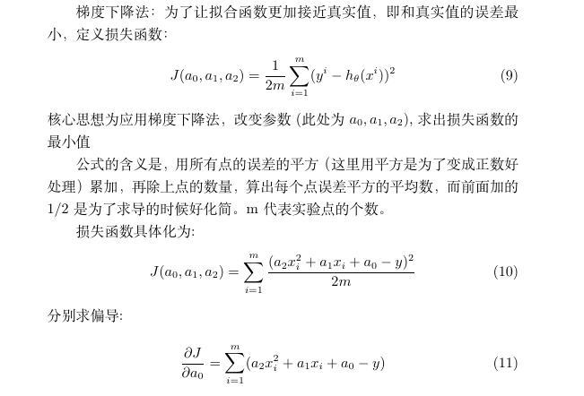
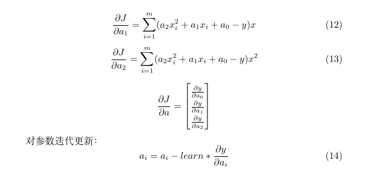
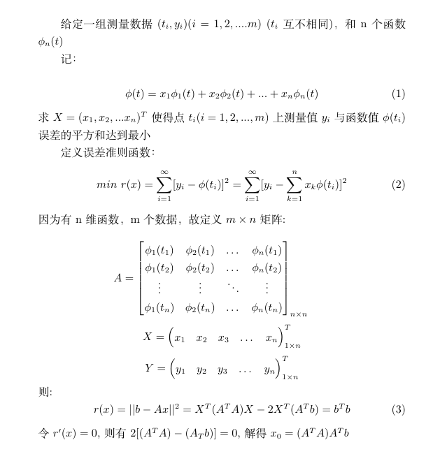
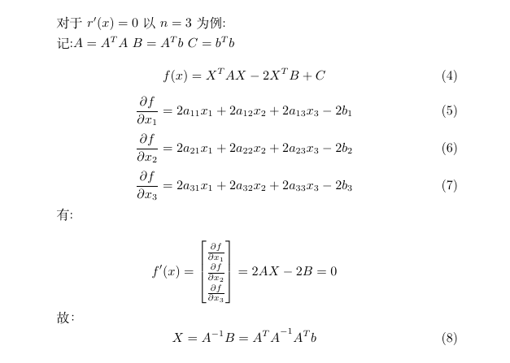
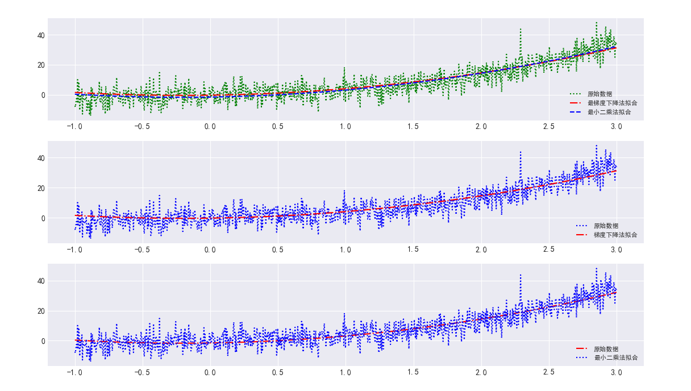
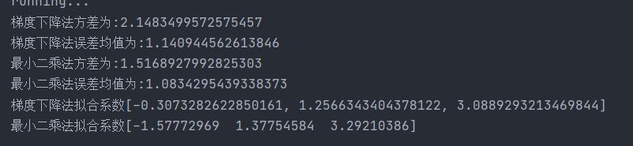

# 多项式与最小二乘法

## 基于梯度的多项式回归

### 直观解释

**最速下山法**

比如我们在一座大山上的某处位置，由于我们不知道怎么下山，于是决定走一步算一步，也就是在每走到一个位置的时候，求解当前位置的梯度，沿着梯度的负方向，也就是当前最陡峭的位置向下走一步，然后继续求解当前位置梯度，向这一步所在位置沿着最陡峭最易下山的位置走一步。这样一步步的走下去，一直走到觉得我们已经到了山脚。当然这样走下去，有可能我们不能走到山脚，而是到了某一个局部的山峰低处（局部最小值）。


核心思想为改变个系数的参数，使得总的代价函数的值最小：

一元函数求最小值：


想求得最小值，只需按照导数下降的方向进行迭代即可，经过一定次数的迭代，若为陷入局部极小值，最终便可求得最小值

**推广到多元：**

令函数分别对多个系数进行求导，让多个系数均向着导数下降的方向进行迭代

### 应用到拟合

由于拟合的函数为二次，共三个系数，因此为一个三元问题：





### 代码实现

#### 准备工作

```python
#预测形式
def predict(a0, a1, a2,  x):
    return a0 + a1 * x + a2 * pow(x, 2)

# 规定学习参数 并初始化拟合参数
learn = 0.001
a0 = 0
a1 = 0
a2 = 0

#数据导入  地址根据具体情况修改
dataFile = 'D:\\learn_software\\program_file\\PycharmProject\\class-03\\original_data.mat'
data = scio.loadmat(dataFile)
original_data=data['original_data']
x_data=original_data[0]
y_data=original_data[1]
print(original_data)

```

#### 函数实现

```python
# 梯度下降法确定拟合系数
def gradient_d(end, learn, data_x, data_y, a0, a1, a2):
    """
    计算总数据量，算出各个系数

    :param end: 迭代次数
    :param learn: 学习率
    :param data_x: x轴数据集
    :param data_y: y轴数据集
    :param a0: 常数项
    :param a1: 一次
    :param a2: 二次
    :param a3: 三次
    :return:
    """
    for item in range(end):
        a0_t = 0
        a1_t = 0
        a2_t = 0
        # a3_t = 0
        m = float(len(data_x))
        # 损失函数对各个系数的求导，累加和的求导转换为求导的累加和
        # 损失函数方便求导时多定义了个1/2，此处刚好抵消
        for i in range(len(data_x)):
            a0_t += (a0 + a1 * data_x[i] + a2 * pow(data_x[i], 2)) - data_y[i]
            a1_t += ((a0 + a1 * data_x[i] + a2 * pow(data_x[i], 2)) - data_y[i]) * data_x[i]
            a2_t += ((a0 + a1 * data_x[i] + a2 * pow(data_x[i], 2)) - data_y[i]) * pow(data_x[i], 2)

        # 导数的最终结果
        a0_t = a0_t / m
        a1_t = a1_t / m
        a2_t = a2_t / m
        # 向损失函数减小的方向更新
        a0 = a0 - (learn * a0_t)
        a1 = a1 - (learn * a1_t)
        a2 = a2 - (learn * a2_t)

    return a0, a1, a2
```

#### 算法调优

在使用梯度下降时，需要进行调优。哪些地方需要调优呢？

1. **算法的步长选择**。步长取值取决于数据样本，可以多取一些值，从大到小，分别运行算法，看看迭代效果，如果损失函数在变小，说明取值有效，否则要增大步长。步长太大，会导致迭代过快，甚至有可能错过最优解。步长太小，迭代速度太慢，很长时间算法都不能结束。所以算法的步长需要多次运行后才能得到一个较为优的值。
2. **算法参数的初始值选择**。初始值不同，获得的最小值也有可能不同，因此梯度下降求得的只是局部最小值；当然如果损失函数是凸函数则一定是最优解。由于有局部最优解的风险，需要多次用不同初始值运行算法，关键损失函数的最小值，选择损失函数最小化的初值。
3. **归一化**。由于样本不同特征的取值范围不一样，可能导致迭代很慢，为了减少特征取值的影响，可以对特征数据归一化。

## 最小二乘法

### 公式推导



### 求导过程

最小二乘法的代数法解法就是对 xi 求偏导数，令偏导数为0，再解方程组，得到 xi 。



### 代码实现

#### 准备工作

```python
#预测形式
def predict(a0, a1, a2,  x):
    return a0 + a1 * x + a2 * pow(x, 2)

# 规定学习参数 并初始化拟合参数
learn = 0.001
a0 = 0
a1 = 0
a2 = 0

#数据导入  地址根据具体情况修改
dataFile = 'D:\\learn_software\\program_file\\PycharmProject\\class-03\\original_data.mat'
data = scio.loadmat(dataFile)
original_data=data['original_data']
x_data=original_data[0]
y_data=original_data[1]
print(original_data)


```

#### 拟合参数

```python
def ls(x_data,y_data):
    # 二阶拟合对应三个系数，1000个数据，规定A为[1000,3]的矩阵
    # 先定义A为[3,1000]方便数据导入
    A=np.zeros((3,1000))
    for i in range(3):
        A[i]=pow(x_data,i)
        
    # 将A转换成 [3,1000]的形式
    A=A.T
    # 记录A的转置
    A_T=A.T
    b=np.zeros(1000)
    b=y_data
    b=b.T


    x=np.zeros((3,1))
    x=np.dot(np.linalg.inv(np.dot(A_T,A)),(np.dot(A_T,b)))

    return x
```

### 局限性

首先，最小二乘法需要计算 $X^TX$ 的逆矩阵，有可能它的逆矩阵不存在，这样就没有办法直接用最小二乘法了，此时梯度下降法仍然可以使用。当然，我们可以通过对样本数据进行整理，去掉冗余特征。让 XTX 的行列式不为0，然后继续使用最小二乘法。

第二，当样本特征 n 非常的大的时候，计算 $X^TX$ 的逆矩阵是一个非常耗时的工作（ n×n 的矩阵求逆），甚至不可行。此时以梯度下降为代表的迭代法仍然可以使用。那这个 n 到底多大就不适合最小二乘法呢？如果你没有很多的分布式大数据计算资源，建议超过10000个特征就用迭代法吧。或者通过主成分分析降低特征的维度后再用最小二乘法。

第三，如果拟合函数不是线性的，这时无法使用最小二乘法，需要通过一些技巧转化为线性才能使用，此时梯度下降仍然可以用。

## 拟合结果

**梯度下降法迭代1000次的结果**





