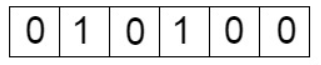
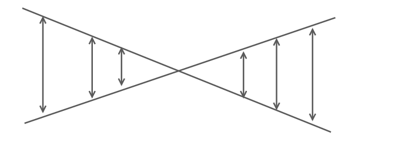
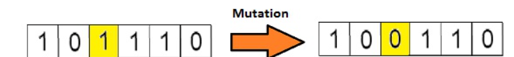
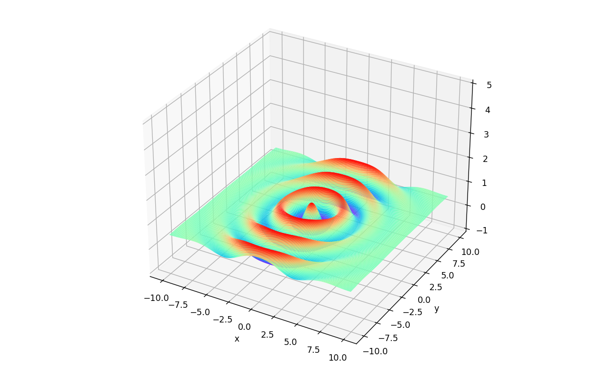

# 遗传算法

## 背景

物竞天择，适者生存。自然界中能够适应环境的个体得以生存，优秀性状保留下来。而优秀性状的保留使得后续向着更好的方向进化

而在数学的上的概念即为改变输入值(如只保留好的输入值)，从而改变输出值。经过多次迭代输入值的不断改变，最终得到一个较好的符合期望的输出值

## 基本特征

1. 智能式搜索：依据适应度（目标函数）进行只能搜索
2. 渐进式优化：利用复制、交换、突变等操作，使下一代结果优于上一代
3. 全局最优解：采用交换和突变操作产生新个体，使得搜索得到的优化结果逼近全局最优解
4. 黑箱式结构：根据问题的特性进行编码（输入）和确定适应度（输出），具有只考虑输入与输出关系的黑箱式就够，并不深究输入与输出关系的原因
5. 通用性强：不要求明确的数学表达式，只需要一些简单的原则要求，可应用于解决离散问题、函数关系不明确的复杂问题
6. 并行式运算：每次迭代计算都是对群体中所有个体同时进行运算，是并行式运算方式，搜索速度快

## 具体步骤

为了表述出个体对环境的适应程度，借用了生物上染色体的概念，染色体上每一个节点代表一个性状，每个性状对环境的适应都有一定程度上的贡献，最终可以求出中的适应贡献度



而为了表述出染色体，采用二进制编码，每一位对应一个性状，对于长度10的染色体，使用长度为10bit的二进制数来进行表示

根据每个个体染色体上的性状形况，我们可以计算出总的适应贡献度，我们将其称为个体的适应度

在进行下一代的选择时，拥有更高适应度的个体有着更高的存活几率

### 选择

通过轮盘赌算法，一次获得两个亲本，用于交叉产生下一代

**轮盘赌算法**

> 引入“适应度”与“累积概率”的概念，其中每个部分被选中的概率与其适应度值成比例。设某一部分x(i)的适应度值表示为f(xi)，该部分被选中的概率为p(xi)，累积概率为q(xi)，对应的计算公式如下：
>
> 上式中的累积概率表示每个个体之前所有个体的选择概率之和，它相当于在转盘上的“跨度”，“跨度”越大越容易选到，就相当于概率论中的概率分布函数F(x)。轮盘赌选择法的过程如下：
>
> （1）计算每个个体的被选中概率p(xi)
>
> （2）计算每个部分的累积概率q(xi)
>
> （3）随机生成一个数组m，数组中的元素取值范围在0和1之间，并将其按从小到大的方式进行排序。若累积概率q(xi)大于数组中的元素m[i]，则个体x(i)被选中，若小于m[i]，则比较下一个个体x(i+1)直至选出一个个体为止。
>
> （4）若需要转中N个个体，则将步骤（3）重复N次即可

### 交叉

选择一位偏移量，直接进行互换



### 变异

生物学的角度上定义为染色体某一位发生变化，对应着这一位取反



## 应用

使用遗传算法求一个二元函数的最大值问题，二元函数如下：


画出图像：

```python
from mpl_toolkits.mplot3d import Axes3D
import numpy as np
from matplotlib import pyplot as plt

fig = plt.figure(figsize=(10,6))
ax = Axes3D(fig)
x = np.arange(-10, 10, 0.1)
y = np.arange(-10, 10, 0.1)
X, Y = np.meshgrid(x, y)       
Z = 0.5 - (np.sin(np.sqrt(X**2+Y**2))**2 - 0.5)/(1 + 0.001*(x**2 + y**2)**2)
plt.xlabel('x')
plt.ylabel('y')
ax.set_zlim([-1,5])
ax.plot_surface(X, Y, Z, rstride=1, cstride=1, cmap='rainbow')
plt.show()
```



```python
import math, random


class Population:
    # 种群的设计
    def __init__(self, size, chrom_size, cp, mp, gen_max):
        # 种群信息合
        self.individuals = []  # 个体集合
        self.fitness = []  # 个体适应度集
        self.selector_probability = []  # 个体选择概率集合
        self.new_individuals = []  # 新一代个体集合

        self.elitist = {'chromosome': [0, 0], 'fitness': 0, 'age': 0}  # 最佳个体的信息

        self.size = size  # 种群所包含的个体数
        self.chromosome_size = chrom_size  # 个体的染色体长度
        self.crossover_probability = cp  # 个体之间的交叉概率
        self.mutation_probability = mp  # 个体之间的变异概率

        self.generation_max = gen_max  # 种群进化的最大世代数
        self.age = 0  # 种群当前所处世代

        # 随机产生初始个体集，并将新一代个体、适应度、选择概率等集合以 0 值进行初始化
        v = 2 ** self.chromosome_size - 1
        for i in range(self.size):
            self.individuals.append([random.randint(0, v), random.randint(0, v)])
            self.new_individuals.append([0, 0])
            self.fitness.append(0)
            self.selector_probability.append(0)

    # 归一化映射
    def decode(self, interval, chromosome):
        '''将一个染色体 chromosome 映射为区间 interval 之内的数值'''
        d = interval[1] - interval[0]
        n = float(2 ** self.chromosome_size - 1)
        return (interval[0] + chromosome * d / n)

    def fitness_func(self, chrom1, chrom2):
        '''适应度函数，可以根据个体的两个染色体计算出该个体的适应度'''
        interval = [-10.0, 10.0]
        (x, y) = (self.decode(interval, chrom1),
                  self.decode(interval, chrom2))
        # 定义要求的函数的形式
        n = lambda x, y: math.sin(math.sqrt(x * x + y * y)) ** 2 - 0.5
        d = lambda x, y: (1 + 0.001 * (x * x + y * y)) ** 2
        func = lambda x, y: 0.5 - n(x, y) / d(x, y)
        return func(x, y)

    def evaluate(self):
        '''用于评估种群中的个体集合 self.individuals 中各个个体的适应度'''
        sp = self.selector_probability
        for i in range(self.size):
            self.fitness[i] = self.fitness_func(self.individuals[i][0],  # 将计算结果保存在 self.fitness 列表中
                                                self.individuals[i][1])
        ft_sum = sum(self.fitness)
        for i in range(self.size):
            sp[i] = self.fitness[i] / float(ft_sum)  # 得到各个个体的生存概率
        # 需要将个体的生存概率进行叠加，从而计算出各个个体的选择概率
        # 相加本身并无意义，只是得到累积概率用于轮盘赌算法
        for i in range(1, self.size):
            sp[i] = sp[i] + sp[i - 1]

    # 轮盘赌博机（选择）
    def select(self):
        (t, i) = (random.random(), 0)
        for p in self.selector_probability:
            if p > t:
                break
            i = i + 1
        return i

    # 交叉
    def cross(self, chrom1, chrom2):
        p = random.random()  # 随机概率
        # 计算出的为十进制形式，但后面做位运算的时候当作二进制来计算
        n = 2 ** self.chromosome_size - 1
        if chrom1 != chrom2 and p < self.crossover_probability:
            t = random.randint(1, self.chromosome_size - 1)  # 随机选择一点（单点交叉）
            mask = n << t  # << 左移运算符
            (r1, r2) = (chrom1 & mask, chrom2 & mask)  # & 按位与运算符：参与运算的两个值,如果两个相应位都为1,则该位的结果为1,否则为0
            mask = n >> (self.chromosome_size - t)
            (l1, l2) = (chrom1 & mask, chrom2 & mask)
            (chrom1, chrom2) = (r1 + l2, r2 + l1)
        return (chrom1, chrom2)

    # 变异
    def mutate(self, chrom):
        p = random.random()
        if p < self.mutation_probability:
            # 选择一个变异位置
            t = random.randint(1, self.chromosome_size)
            mask1 = 1 << (t - 1)
            mask2 = chrom & mask1
            if mask2 > 0:
                chrom = chrom & (~mask2)  # ~ 按位取反运算符：对数据的每个二进制位取反,即把1变为0,把0变为1
            else:
                chrom = chrom ^ mask1  # ^ 按位异或运算符：当两对应的二进位相异时，结果为1
        return chrom

    # 保留最佳个体
    def reproduct_elitist(self):
        # 与当前种群进行适应度比较，更新最佳个体
        j = -1
        for i in range(self.size):
            if self.elitist['fitness'] < self.fitness[i]:
                j = i
                self.elitist['fitness'] = self.fitness[i]
        if (j >= 0):
            self.elitist['chromosome'][0] = self.individuals[j][0]
            self.elitist['chromosome'][1] = self.individuals[j][1]
            self.elitist['age'] = self.age

    # 进化过程
    def evolve(self):
        indvs = self.individuals
        new_indvs = self.new_individuals
        # 计算适应度及选择概率
        self.evaluate()
        # 进化操作
        i = 0
        while True:
            # 选择两个个体，进行交叉与变异，产生新的种群
            idv1 = self.select()
            idv2 = self.select()
            # 交叉
            (idv1_x, idv1_y) = (indvs[idv1][0], indvs[idv1][1])
            (idv2_x, idv2_y) = (indvs[idv2][0], indvs[idv2][1])
            (idv1_x, idv2_x) = self.cross(idv1_x, idv2_x)
            (idv1_y, idv2_y) = self.cross(idv1_y, idv2_y)
            # 变异
            (idv1_x, idv1_y) = (self.mutate(idv1_x), self.mutate(idv1_y))
            (idv2_x, idv2_y) = (self.mutate(idv2_x), self.mutate(idv2_y))
            (new_indvs[i][0], new_indvs[i][1]) = (idv1_x, idv1_y)  # 将计算结果保存于新的个体集合self.new_individuals中
            (new_indvs[i + 1][0], new_indvs[i + 1][1]) = (idv2_x, idv2_y)
            # 判断进化过程是否结束
            i = i + 2  # 循环self.size/2次，每次从self.individuals 中选出2个
            if i >= self.size:
                break

        # 最佳个体保留
        # 如果在选择之前保留当前最佳个体，最终能收敛到全局最优解。
        self.reproduct_elitist()

        # 更新换代：用种群进化生成的新个体集合 self.new_individuals 替换当前个体集合
        for i in range(self.size):
            self.individuals[i][0] = self.new_individuals[i][0]
            self.individuals[i][1] = self.new_individuals[i][1]

    def run(self):
        '''根据种群最大进化世代数设定了一个循环。
        在循环过程中，调用 evolve 函数进行种群进化计算，并输出种群的每一代的个体适应度最大值、平均值和最小值。'''
        for i in range(self.generation_max):
            self.evolve()
            print(i, max(self.fitness), sum(self.fitness) / self.size, min(self.fitness))


if __name__ == '__main__':
    # 种群的个体数量为 50，染色体长度为 25，交叉概率为 0.8，变异概率为 0.1,进化最大世代数为 150
    pop = Population(50, 24, 0.8, 0.1, 150)
    pop.run()
```

